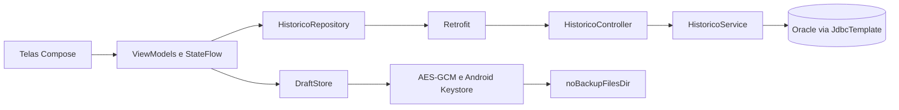

# Parte 1 — Evolução do MindCare Diary

Data: 04/10/2026. Branch: feature/evolucao-mindcare em ambos os repositórios.
Backend baseado na feature/oracle-db, commit 2b15b44. Mobile baseado na versão local com termos e ajustes visuais, commit dade43e.
Trabalho em cópias isoladas: work/evolucao-backend e work/evolucao-mobile. As branches/arquivos dos projetos originais do OneDrive foram preservados porque o ambiente não permitiu gravar seus metadados Git.

## Melhorias e valor agregado
| Antes | Implementado | Valor |
|---|---|---|
| Início buscava todos os registros | Primeira página de 20 registros; histórico com Carregar mais | Limita transferência e montagem de listas |
| Sem pesquisa combinada | Texto literal, datas inclusivas, humor e origem | Localização de registros tradicionais e Chat |
| Textos em edição ficavam apenas em memória | Rascunhos cifrados com AES-GCM e Android Keystore, separados por conta e modo | Continuidade ao reabrir o aplicativo |
| Estado do formulário no Composable | DiarioEditorViewModel, estado imutável e envio injetável | Regras testáveis e preservação em recriação da tela |
| Sem fluxo de busca dedicado | HistoricoViewModel → HistoricoRepository → Retrofit; DTOs separados | Estados de carregamento, erro, vazio e paginação |
| Leitura de termos durante desenho da interface | Leitura em Dispatchers.IO | Retira acesso a arquivo da thread de UI |
| Avatar decodificado na resolução original pela interface | Decodificação assíncrona com amostragem 4 | Reduz a resolução carregada; não altera o arquivo original |
| Respostas 400/403 viravam 500 por prioridade do handler | Handler específico priorizado para Chat, diário, histórico e privacidade, com erros inesperados genéricos | Status coerentes e proteção de detalhes técnicos |
| Erros de login expunham mensagens técnicas | Mensagens genéricas para o usuário e logs sem mensagem bruta | Reduz exposição de detalhes |

## Arquitetura

O endpoint novo é independente das functions e procedures da Parte 3. Não foram alterados scripts PL/SQL, modelo Oracle nem rotina de alerta.
No backend, validação dos filtros e consulta ficam em um serviço dedicado; o controller resolve o titular pela autenticação.

## Contrato do histórico
GET /meu-diario/historico
Autenticação: Bearer JWT de paciente ativo. Não há parâmetro para selecionar outro paciente.
Parâmetros opcionais: texto (até 200 caracteres), inicio/fim (AAAA-MM-DD), humor, origem (CHAT/TRADITIONAL), pagina (base zero), tamanho (1–50, padrão 20).
Retorno: registros, pagina, temMais. Ordem: data decrescente, depois id decrescente para desempate.
Datas incluem todo o último dia. Pesquisa escapa %, _ e ! e usa parâmetros vinculados.
Consulta lê tamanho+1 linhas para determinar se há próxima página, sem COUNT completo.
Paginação por offset: novos registros inseridos durante a navegação podem deslocar páginas; o cliente elimina IDs repetidos. Para volumes maiores, avaliar paginação por cursor.
Resposta usa Cache-Control: no-store.

## Rascunhos e privacidade
- Diário: texto positivo, dificuldades e humor. Chat: falas do usuário, campo em edição, revisão e dados necessários para repetir a mesma tentativa de salvamento.
- Não persiste áudio nem respostas da MIA.
- AES-GCM autenticado; chave no Android Keystore; nome de arquivo derivado de conta e tipo. Arquivos fora de backup automático.
- Após logout, invalida escritores antigos, apaga chave e cópias locais. Após salvamento confirmado, remove o rascunho do modo correspondente.
- Botão Descartar pede confirmação. Mudanças recentes podem não chegar ao disco se o processo for encerrado antes de concluir a gravação; o fluxo não promete durabilidade instantânea de cada tecla.
- Chat mantém o mesmo corpo e identificador ao recuperar uma tentativa incerta, evitando duplicação no endpoint idempotente existente.
- Diário impede envios simultâneos. A API tradicional não ganhou idempotência nesta entrega: após erro de comunicação, o usuário é orientado a consultar o histórico antes de repetir.
- Política e Termos foram atualizados para versão 2026-10-04.1, em arquivos idênticos no mobile e backend. Publicar as duas partes juntas.
- Cifrar rascunhos não substitui autenticação, HTTPS em produção nem revisão jurídica dos demais tratamentos.

## Evidências de testes
- 6 testes novos do backend: autenticação/perfil, titular obtido da sessão, isolamento, paginação com desempate, filtros combinados, datas inclusivas, busca parametrizada, limites e tratamento HTTP sem exposição de detalhes.
- 23 testes unitários mobile passaram (18 anteriores + 5 novos). Novos casos: recuperar/descartar, bloquear duplo envio, manter texto após falha, repetir página após erro, recuperar chave de salvamento incerto do Chat sem persistir resposta da MIA.
- APK de aplicativo e APK dos testes instrumentados compilados.
- 6 testes instrumentados aprovados no emulador Android API 37: Chat (2), contexto do aplicativo, aceite dos termos, histórico e Keystore/isolamento/invalidação de escritor. Capturas do Chat e histórico inspecionadas, sem cortes nos controles desses cenários. Os testes de interface usam repositórios simulados e dados sintéticos; não comprovam o fluxo completo login → backend → IA.
- Consulta SQL exercitada em H2 MODE=Oracle e no Oracle real MINDCARE_TEST: filtros, datas inclusivas, paginação e isolamento passaram. Um segundo teste Oracle garante dois registros tradicionais sem identificador enviado pelo app.
- Suíte completa final backend reexecutada após disponibilizar Oracle e MINDCARE_TEST: 145 testes aprovados, zero falhas, zero erros e zero ignorados. BUILD SUCCESS em 27,892 segundos (04/10/2026).
- As mesmas três falhas de MiaControllerTest foram reproduzidas na cópia intocada da branch Oracle. Foram corrigidas nesta entrega ao priorizar o handler específico sobre o genérico. Os seis testes do MiaController passaram na execução final.
- Compilação mobile validada na ferramenta já disponível (Gradle 8.13 e configuração da cópia de testes). Arquivos de configuração Gradle do projeto original não foram rebaixados; validar também com a versão utilizada pelo grupo.
- Atualizadas as dependências AndroidX de testes para Espresso 3.7.0 e ext.junit 1.3.0, corrigindo incompatibilidade da versão antiga com o emulador API 37. Referência: https://developer.android.com/jetpack/androidx/releases/test. O crash anterior do processo do emulador não foi diagnosticado por estes testes.

## Roteiro para demonstração
1. Usar backend desta branch com Oracle e rotinas da colega instaladas. Manter configurações de senha/API em variáveis de ambiente, fora do código.
2. Instalar o APK desta entrega no emulador. Seu endereço de backend continua http://10.0.2.2:8080.
3. Entrar com conta de teste e aceitar os termos atualizados.
4. Escrever um rascunho no diário, sair da tela e reabrir: conferir recuperação. Descartar e verificar campos vazios.
5. Repetir no Chat; somente o texto do paciente deve reaparecer após reabrir. Confirmar salvamento e verificar limpeza.
6. Abrir Pesquisar histórico, combinar filtros e verificar limites do período. Com mais de 20 registros, usar Carregar mais.
7. Interromper o backend durante consulta e verificar mensagem e Tentar novamente.
8. Sair da conta e reentrar; o rascunho não deve ser recuperado. Testar com segunda conta para isolamento.
9. Guardar capturas de tela e resultados como evidências da banca. Não usar dados reais de pacientes na demonstração.

## Entrega e limites
Entrega organizada na branch feature/evolucao-mindcare de cada repositório, para revisão antes de qualquer merge. A branch da colega foi preservada.
Não executar o APK novo com backend antigo: faltará o endpoint de histórico e a versão dos termos divergirá.
A Parte 2/3 continua sob responsabilidade da colega; esta entrega não comprova implantação de Oracle, DER ou completude das duas functions e duas procedures do enunciado.

## Correção identificada na validação Oracle
A restrição composta (paciente_id, id_requisicao) impedia múltiplos registros do
mesmo paciente sem UUID no Oracle. O repositório agora atribui UUID quando ausente,
preservando o identificador fornecido pelo Chat. Não foram modificadas rotinas PL/SQL.
O teste instrumentado de rascunhos usa diretório e alias Keystore exclusivos de
teste, sem apagar rascunhos ou chaves reais do aplicativo.
